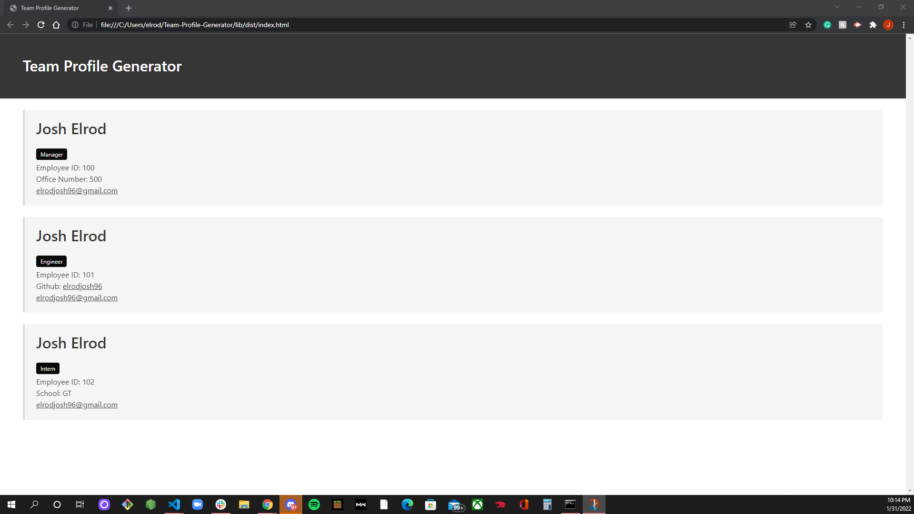

# Team-Profile-Generator

[](https://opensource.org/licenses/MIT)

[](https://youtu.be/-hCk3nWf-qg)

## Table of Contents

* [Description](#description)
* [Installation](#installation)
* [Usage](#usage)
* [Contribution](#contribution)
* [Test](#test)
* [License](#license)
* [Questions](#questions)


## Description
I was tasked with building a Node.js command-line app to add employees and their info to a Team Profile page. I ran tests to make sure this app didn't have any bugs. I have followed the following User Story and Acceptance Criteria in doing all of this.

## User Story

```md
AS A manager
I WANT to generate a webpage that displays my team's basic info
SO THAT I have quick access to their emails and GitHub profiles
```

## Acceptance Criteria

```md
GIVEN a command-line application that accepts user input
WHEN I am prompted for my team members and their information
THEN an HTML file is generated that displays a nicely formatted team roster based on user input
WHEN I click on an email address in the HTML
THEN my default email program opens and populates the TO field of the email with the address
WHEN I click on the GitHub username
THEN that GitHub profile opens in a new tab
WHEN I start the application
THEN I am prompted to enter the team manager’s name, employee ID, email address, and office number
WHEN I enter the team manager’s name, employee ID, email address, and office number
THEN I am presented with a menu with the option to add an engineer or an intern or to finish building my team
WHEN I select the engineer option
THEN I am prompted to enter the engineer’s name, ID, email, and GitHub username, and I am taken back to the menu
WHEN I select the intern option
THEN I am prompted to enter the intern’s name, ID, email, and school, and I am taken back to the menu
WHEN I decide to finish building my team
THEN I exit the application, and the HTML is generated
```
## Installation

## Usage

## Contribution

## Test 
After downloading this onto your machine, in the terminal run npm test to see the tests work. Once those are finished you will run npm start and will go through the prompts to generate your team's profile. Here are images of the command line prompts and generated HTML page you will be using.



## License
This app is using The MIT License
## Questions
Email: 
elrodjosh96@gmail.com
Github Username:
elrodjosh96
